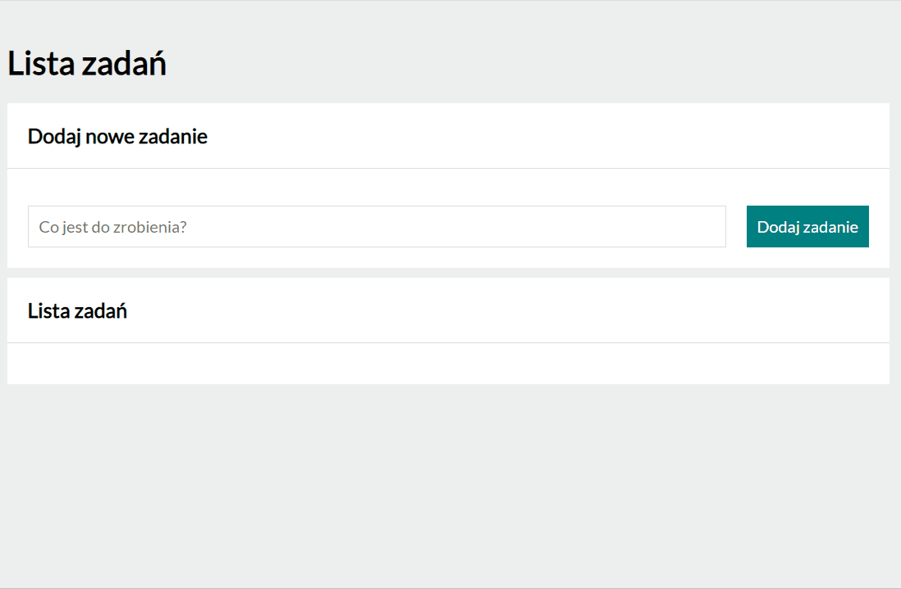

# ✅ To Do List

## 🔍 Demo
[Link to the demo](https://marianna-weychan.github.io/TO-DO-List/)

##  ⌨️ Short description

A simple to-do list app. It allows you to save the activities that you have to do, select and/or hide all completed activities or completely remove them from the list after completing them.

I created this application as part of learning programming at YouCode school.

## 👩‍💻 Used Technoligies:
- HTML,
- CSS,
- BEM convention,
- JAVA SCRIPT ES6,
- GIT
- FLEX
- GRID
